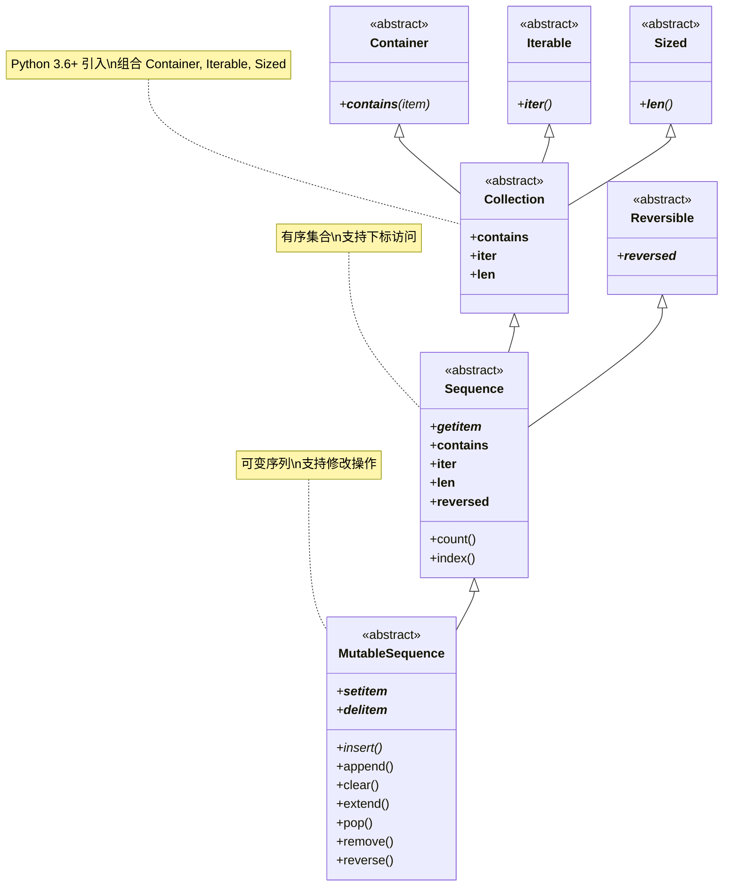

# 序列构成的数组

> 字节序列和Unicode字符串

内置序列类型的分类：

- 按照存放的数据类型
  - 容器序列：`list`、`tuple`和`collections.deque`
  - 扁平序列：`str`、`bytes`、`bytearray`、`memoryview`和`array.array`

- 按照能否被修改
  - 可变序列：`list`、`bytearray`、`array.array`、`collections.deque`和`memoryview`
  - 不可变序列：`tuple`、`str`和`bytes`


> 容器序列存放的是任意类型对象的引用，而扁平序列里存放的是字符、字节或数值基础类型的值

`collections.abc`中的UML类图:



列表推导式：

```python
[ord(symbol) for symbol in '*&%^$#@']

```

> Python解释器会忽略代码里`[]`、`{}`和`()`中的换行

> 列表推导、生成器表达式、集合推导以及字典推导式内部的变量都有自己的局部作用域


